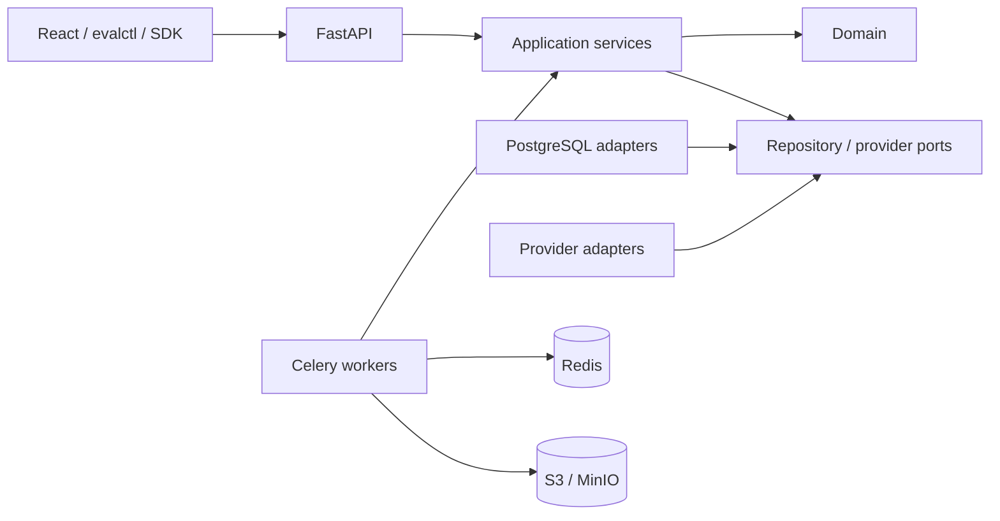

# LLM Evaluation Platform

LLM Evaluation Platform is an open-source, typed monorepo for reproducible
offline evaluation of language models, retrieval-augmented generation systems,
and tool-using agents.

The repository now provides an executable production-oriented vertical slice
across Phases 2–10:

- immutable, schema-validated dataset versions with stable canonical hashes,
  JSON/JSONL/CSV/Parquet parsing, diffs, deterministic sampling, redaction, and
  MinHash/LSH contamination screening;
- immutable experiment and system snapshots, legal run-state transitions,
  PostgreSQL-backed tasks and leases, transactional outbox delivery, retry and
  timeout policy, budgets, cancellation, pause/resume, and a no-cost fake
  provider;
- vendor-neutral OpenAI-compatible, local, and generic HTTP adapters with a
  stable error taxonomy, usage extraction, idempotency keys, response limits,
  and SSRF-aware destination validation;
- versioned language, RAG, agent-trajectory, latency, token, throughput, cost,
  refusal, and failure metrics with isolated failures and explicit aggregate
  denominators;
- deterministic balanced pair designs, blinded assignments, strict pointwise
  and pairwise judge output, bounded repair/retries, disagreement, calibration,
  drift, and prompt-injection-aware evidence envelopes;
- paired experiment comparisons with t, Wilson, exact, bootstrap, permutation,
  Wilcoxon, sign, McNemar, effect-size, multiple-comparison, power, TOST,
  Bradley–Terry, Davidson, and descriptive Elo procedures;
- JSON, formula-safe CSV, Markdown, and printable HTML reports plus
  machine-readable regression gates with meaningful nonzero CLI exits;
- FastAPI/OpenAPI, typed Python SDK, `evalctl`, Celery workers, an accessible
  React dashboard, PostgreSQL, Redis, MinIO, Alembic, structured logs,
  Prometheus/OpenTelemetry, Docker Compose, restricted Kubernetes manifests,
  alerts, runbooks, supply-chain workflows, and CI.

This remains a deliberately scoped, functioning platform rather than a claim
that every optional enterprise feature is finished. Independent model/prompt/
retriever registries, staged million-record import jobs, database partition
automation, and some dashboard configuration workflows remain future work.

## Quick start

Prerequisite: Docker with Compose v2.

```bash
cp .env.example .env
make dev-up
make seed
make demo
```

`make demo` seeds three synthetic QA records, runs deterministic baseline and
candidate experiments, creates a paired comparison and confidence interval,
evaluates a deliberately failing regression gate, stores a checksum-verified
Markdown report in MinIO, and prints a machine-readable summary. It requires no
paid API key and sends no evaluation data outside the local Compose network.

Local services:

| Service | URL or port |
| --- | --- |
| API | `http://localhost:8000` |
| OpenAPI UI | `http://localhost:8000/api/docs` |
| Dashboard | `http://localhost:5173` |
| MinIO console | `http://localhost:59001` |
| PostgreSQL | `localhost:55432` |
| Redis | `localhost:56379` |

The infrastructure host ports are configurable through
`EVAL_POSTGRES_HOST_PORT`, `EVAL_REDIS_HOST_PORT`,
`EVAL_MINIO_HOST_PORT`, and `EVAL_MINIO_CONSOLE_HOST_PORT`. Container-to-
container addresses remain on their standard ports.

The seeded development organization is
`01900000-0000-7000-8000-000000000001`. Development header identity is
intentionally unsafe for an Internet-facing deployment and is rejected when
`EVAL_ENVIRONMENT=production`.

## Development checks

Python 3.12, uv 0.12, and Node.js 24.15 or newer are required for host-side
development:

```bash
uv sync --all-extras --frozen
make lint
make format-check
make typecheck
make test
uv run coverage run -m pytest -m "not integration and not performance and not live_provider"
uv run coverage report
make docs
uv run python -m build
npm ci
npm run audit
npm run lint
npm run typecheck
npm test
npm run build
```

The default tests are deterministic and perform no paid provider calls. Live
provider tests, when added, use the explicit `live_provider` marker and are
excluded from default CI.

## Gemini 3.6 Flash benchmark

On 2026-07-30, the platform ran a bounded live benchmark against
[`gemini-3.6-flash`](https://ai.google.dev/gemini-api/docs/models/gemini-3.6-flash)
through Google's
[OpenAI-compatible endpoint](https://ai.google.dev/gemini-api/docs/openai).
Google identifies this as a stable model; a specific stable identifier was used
instead of the mutable `latest` alias.

| Measure | Observed result | Uncertainty or denominator |
| --- | ---: | --- |
| Case-level majority normalized exact match | 24/24 (100%) | 95% Wilson CI: 86.20%–100%; effective n=24 |
| Request-level exact match | 72/72 (100%) | Descriptive only; three requests per case are clustered |
| Fully consistent cases | 24/24 (100%) | All three normalized outputs agreed |
| Request failures | 0/72 (0%) | 95% Wilson CI: 0%–5.07% |
| End-to-end latency p50 | 1,262.817 ms | 95% case-cluster bootstrap CI: 1,216.631–1,317.377 ms |
| End-to-end latency p95 | 1,639.355 ms | 95% case-cluster bootstrap CI: 1,501.440–16,868.478 ms |
| Mean/minimum/maximum latency | 1,925.083 / 919.032 / 20,858.546 ms | 72 completed sequential requests |
| Provider-reported tokens | 3,320 | 3,153 input; 167 billable output including thinking |
| Standard list-price estimate | $0.005982 | Actual tier/billing can differ; pilot traffic is excluded |

The p95 interval is intentionally not hidden or narrowed: all three
`extraction-ip` repetitions were slow (13.59–20.86 seconds), producing a
case-correlated tail. This single-location sequential test measures
client-observed latency, not time to first token or maximum throughput.

The fixed protocol used 24 synthetic exact-answer cases across arithmetic,
classification, extraction, language, logic, and science, with three
repetitions per case. The schedule was randomized with seed `20260730`;
concurrency was one; `reasoning_effort` was `minimal`; sampling parameters were
omitted; output was capped at 256 tokens; and each request had at most four
attempts. The primary outcome first reduced repetitions to one majority result
per case, then used a Wilson interval. Latency intervals used 10,000 percentile
bootstrap resamples clustered by case. Failures remained in the planned
denominator.

This is a smoke benchmark of constrained answers, not a general intelligence,
open-ended quality, RAG, safety, coding, or agent benchmark. Each category has
only four cases, so its individual 4/4 result has a wide 51.01%–100% Wilson
interval. The clean run followed a protocol-tuning pilot whose observations
were discarded before analysis. Token cost uses Google's
[standard list prices](https://ai.google.dev/gemini-api/docs/pricing) current on
the execution date; actual account charges may be free or different.

Reproducibility artifacts:

- Dataset: [`examples/benchmarks/core-v1.jsonl`](examples/benchmarks/core-v1.jsonl),
  SHA-256 `26d7194712c5550d412bec92968ca14dfe103a60c4df18862a86a53c28e8d035`.
- Complete sanitized observations and aggregate result:
  [`benchmark-results/gemini-3.6-flash-2026-07-30.json`](benchmark-results/gemini-3.6-flash-2026-07-30.json),
  SHA-256 `fad945873170decacb5575faaec1c5df1015379ab0bb2813e3a29a887b765727`.
- Runner: [`scripts/benchmark_gemini.py`](scripts/benchmark_gemini.py).

Run it without putting the credential in a command argument or file:

```bash
read -rsp "Gemini API key: " GEMINI_API_KEY
echo
export GEMINI_API_KEY
uv run python scripts/benchmark_gemini.py \
  --output benchmark-results/gemini-3.6-flash-local.json
unset GEMINI_API_KEY
```

## Architecture



Domain and application packages do not depend on FastAPI, Celery, SQLAlchemy,
or a vendor SDK. PostgreSQL remains authoritative; Redis is disposable delivery
and coordination state. Large-artifact object keys are validated and payloads
are SHA-256 verified. Tenant and project IDs are carried through foreign keys,
authorization checks, and repository filters.

Read the [architecture foundation](docs/architecture/platform-foundation.md),
[dataset identity](docs/concepts/versioned-datasets.md),
[evaluation engine](docs/concepts/evaluation-engine.md), and
[metric framework](docs/concepts/metric-framework.md) for algorithms,
tradeoffs, failure modes, security implications, and code references.

## Repository map

```text
apps/api       FastAPI composition and versioned routes
apps/worker    Celery outbox relay and resumable execution
apps/cli       evalctl automation interface
apps/web       React/Vite dashboard
packages/domain
packages/application
packages/infrastructure
packages/providers
packages/metrics
packages/evaluators
packages/statistics
packages/schemas
packages/sdk
migrations     Ordered Alembic schema history
tests          Unit, property, contract, integration, security, and performance suites
docs           Design, concepts, architecture, guides, operations, tests, ADRs
deploy/docker  Non-root multi-stage images
```

## Scope and limitations

The implemented vertical slice is installable and exercises datasets,
asynchronous evaluation, code and judge metrics, paired statistics, reports,
gates, access controls, audit records, and production deployment assets.
Remaining expansion areas include independent configuration registries,
staged/streaming import orchestration at million-record scale, automatic table
partition maintenance, complete configuration editors, additional live-provider
contract suites, and sustained distributed load/chaos testing. The
[requirement traceability matrix](docs/design/requirement-traceability-matrix.md)
maps the broader target to code, documentation, tests, and acceptance evidence.

## Security

Do not commit `.env` or provider credentials. Provider snapshots reference
deployment environment variable names and reject secret-bearing fields. Review
[SECURITY.md](SECURITY.md) before reporting a vulnerability and the
[configuration guide](docs/operations/configuration.md) before exposing a
deployment.

## License

Apache License 2.0. See [LICENSE](LICENSE).
