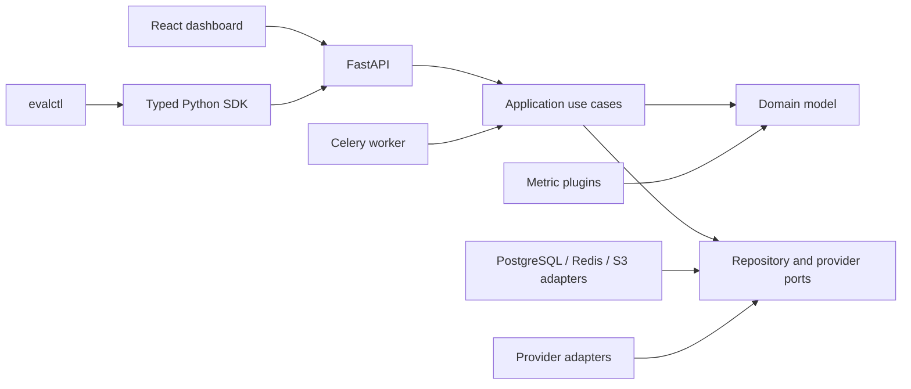
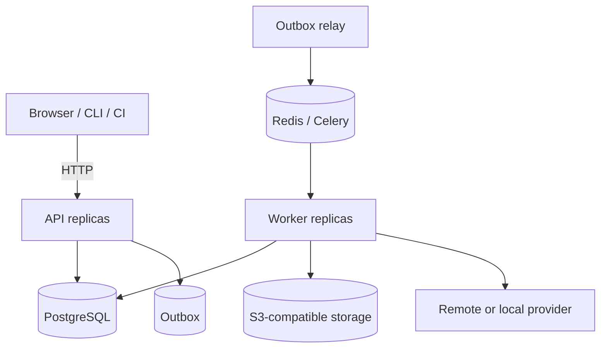

# Platform foundation

## Boundaries and dependency direction

The monorepo applies dependency inversion rather than treating directories as
cosmetic organization:

The domain package has no framework dependency. Application services authorize
use cases, resolve references, enforce immutable configuration, and transact
through protocols. SQLAlchemy, Celery, HTTP, and S3 details live at outer
boundaries. This makes deterministic tests possible without PostgreSQL or a
vendor SDK and prevents a provider change from changing evaluation semantics.

## Runtime containers

PostgreSQL is the durable source of truth for tenants, dataset manifests,
normalized records, immutable experiments, task state, per-sample results,
costs, and audit metadata. Redis is disposable coordination state for Celery;
loss may delay work but must not erase durable progress. MinIO stores large
artifacts using validated tenant-scoped object keys and SHA-256 metadata.

Create operations and outbox records share one PostgreSQL transaction. Broker
delivery is at least once. A unique task natural key, row leases, terminal-state
checks, and unique result constraints make duplicate delivery harmless to
platform state. A remote provider can still bill an ambiguous timed-out request
twice unless it honors the supplied idempotency key; the failure record
therefore preserves the ambiguous-billing flag.

## Database integrity

UUIDv7 identifiers provide stable globally unique keys with time-ordered index
locality. Foreign keys include organization and project where practical so a
cross-tenant relationship cannot be represented accidentally. Check
constraints cover run states, task states, non-negative counters, settled-count
bounds, seeds, and money. Published dataset rows and immutable experiment
configuration are protected by database triggers in addition to application
types. No hard-delete path is exposed for evidence used by an evaluation.

High-volume tables use indexes beginning with the common project/run filter.
At larger scale, `evaluation_samples`, `metric_results`, and audit events should
be range-partitioned by creation month, with project IDs retained in every
partition index. This phase deliberately does not add partitions to the local
schema because empty partitions make development and migrations harder to
inspect; the data model and keys are partition-compatible.

## Tenant and security model

Every resource is organization-owned and most evaluation resources are
project-owned. The `Principal` carries organization, optional project, role,
and optional API-key scopes. Authorization compares all four dimensions and
returns not-found for a cross-tenant reference to reduce identifier
enumeration. Repository queries repeat tenant predicates; PostgreSQL row-level
security policies provide defense in depth for tables introduced by the base
migration.

Development mode accepts explicit identity headers and is rejected in
production. Production API keys use a random bearer value, a non-secret lookup
prefix, and an HMAC-SHA-256 digest with a deployment-held pepper. Logs redact
credential-shaped keys recursively. System snapshots reject secret-bearing
field names: configuration stores `secret_env`, never the provider secret.

Outbound generic HTTP configuration rejects non-HTTP schemes, embedded
credentials, localhost, private, loopback, link-local, and reserved resolved
addresses unless the explicit local-provider adapter is selected. This reduces
SSRF risk but deployments must also enforce egress policy because DNS can
change after validation.

## Observability and shutdown

Middleware accepts or creates a request ID, binds it to structured logs, adds
security headers, and emits latency/request counters. OpenTelemetry spans cross
FastAPI, SQLAlchemy, HTTPX, and Celery when an OTLP endpoint is configured.
Health endpoints distinguish liveness from dependency-backed readiness.

API shutdown disposes the async connection pool. Celery uses late
acknowledgements and a 45-second Compose grace period. A worker that dies loses
its broker delivery, while the durable lease eventually makes nonterminal work
claimable. Provider calls use bounded timeouts and classified retry budgets.

## Operational limitations at Phase 5

The implementation is a production-oriented foundation, not yet the completed
ten-phase product. Project/provider distributed semaphores, durable progress
streaming, database role provisioning for forced RLS, large-upload staging,
Kubernetes manifests, full audit-event emission, pairwise judges, and
inferential statistics remain open. Operators must not infer bit-for-bit
reproducibility from a remote model snapshot: vendors may change weights,
tokenizers, safety layers, routing, or nondeterministic kernels without
changing a public model identifier.
