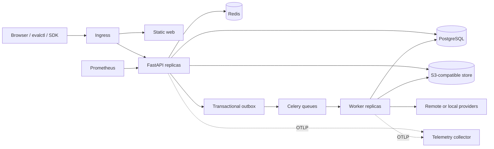

# Production architecture

## Containers and boundaries

PostgreSQL is authoritative for configuration, identity, state transitions,
denominators, cost ledgers, and artifact metadata. Object storage contains
large immutable payloads. Redis is disposable coordination state: queues,
rate-limit windows, and concurrency controls. Rebuilding Redis must not lose
completed result data.

## Dependency direction

Domain packages contain invariants and stable value types. Application packages
orchestrate ports. Provider, object store, database, queue, and web frameworks
are infrastructure. Metrics, evaluators, and statistics expose typed pure
functions where possible. The API and worker are composition roots.

Scientific libraries are lazy-loaded from API paths. This keeps health probes,
authentication, OpenAPI, and CRUD endpoints independent of SciPy startup cost.

## Transaction and delivery semantics

Run creation inserts tasks and an outbox event in one database transaction.
The relay publishes with at-least-once delivery. Workers claim a task using its
natural key and renewable lease. A duplicate message either finds terminal work
or safely reacquires an expired lease. Provider idempotency keys are used where
supported; ambiguous billing is recorded rather than silently retried.

State transitions use explicit domain edges, row locks, optimistic version
stamps, and database checks. Partial sample and metric results survive worker
loss. Cancellation stops new dispatch and active workers cooperate at bounded
checkpoints.

## Multi-tenancy

Every project-owned table carries organization and project identifiers.
Composite foreign keys prevent cross-project references. API authorization
scopes queries before lookup, returning not-found for cross-tenant IDs. PostgreSQL
row-level security adds a second organization boundary using the transaction
setting `app.organization_id`.

Provider credentials are injected into worker processes. Immutable snapshots
store only secret references and non-sensitive configuration. Audit events
form an organization-serialized SHA-256 hash chain.

## Scale path

- API replicas are stateless and scale on CPU/latency.
- Worker replicas scale on queue depth with separate queue priorities.
- Dispatch windows bound fan-out and implement backpressure.
- Dataset and result exploration uses keyset pagination.
- Raw traces and long outputs move to object storage.
- Metric aggregates are incrementally recomputable and include state counts.
- High-volume result tables should be range-partitioned by creation month once
  sustained volume makes partition pruning beneficial. The run and metric
  indexes remain local to each partition.
- PostgreSQL connection capacity, provider quotas, and object-store request
  rates usually bottleneck before API CPU.

The cluster manifests set requests, limits, disruption budgets, restricted pod
security, read-only roots, and worker termination grace. Production should use
managed multi-AZ PostgreSQL, Redis with persistence appropriate to queue loss
tolerance, versioned object storage, workload identity, and external secrets.

## Failure recovery

Database loss stops writes and readiness. Redis loss returns 503 from
distributed rate limiting and pauses queue work; durable run state remains.
Object-store failure blocks large artifact publication while metadata stays
reconcilable. Provider outages use normalized retry policy and continue-on-error
when configured.

Recovery order is PostgreSQL, object storage, Redis, migration verification,
API, scheduler, then workers. After restoration, reconcile unfinished object
uploads, expire stale task leases, replay unpublished outbox rows, and compare
ledger totals before resuming dispatch.

## Data retention

Immutable versions and completed experiment snapshots use restrictive deletion.
Catalog deletion is soft. Project policy should expire raw provider responses,
retrieval traces, trajectories, and report artifacts before normalized aggregate
metadata. A legal hold overrides scheduled deletion. Deletion jobs record audit
events and tombstones so historical reports state which artifacts are no longer
available.
