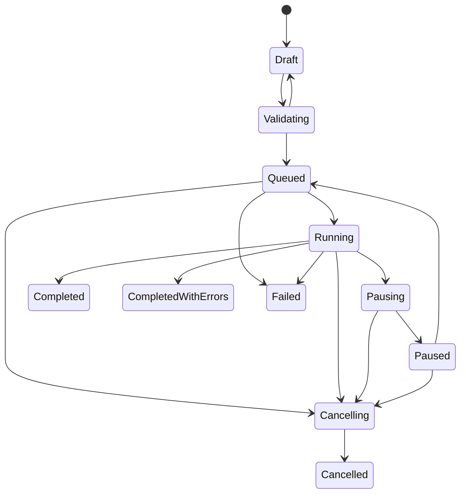

# Evaluation engine

## Immutable experiment identity

An experiment resolves a dataset version and a secret-free
system-under-test snapshot. The snapshot includes provider adapter
configuration, model identifier, prompt template, and generation parameters.
The experiment additionally stores the evaluation suite, 64-bit seed,
application version, dependency-lock hash, and a canonical configuration hash.
Runs reference this immutable experiment, so retrying execution does not silently
adopt a new prompt, metric list, or provider configuration.

Provider-side model behavior may still prevent exact output reproduction.
Temperature zero is not a mathematical determinism guarantee, and vendors can
change routing, model weights, preprocessing, policy layers, or token accounting.
The platform records enough evidence to explain what it requested; it cannot
freeze an external service.

## Run state machine

The domain aggregate rejects every transition absent from the graph. Tests
exhaustively check the state-pair Cartesian product. PostgreSQL repeats the
allowed-state constraint and a transition trigger. Every transition appends a
sequenced state event and advances an optimistic `version_stamp`.

## Bounded scheduling and at-least-once work

Run creation generates at most `records × repetitions` tasks in one bounded
transaction. Each task has a natural uniqueness key of run, record key,
repetition, and snapshot. A transactional outbox event announces the queued
run. The relay marks an event published only after Celery accepts it.

A worker claims one pending or expired-leased row with `FOR UPDATE SKIP
LOCKED`. It commits the lease before making a provider call. Successful and
failed completion take the task and run rows under locks, check terminal state,
write a sample, response/failure, metric results, cost, and counters in one
transaction. Replayed delivery observes terminal work and does not create a
second result.

The lease is a recovery mechanism, not a distributed mutex around provider
billing. If a worker dies after the provider accepts a request but before the
database commit, the next attempt may call again. Provider idempotency keys
reduce this risk where supported, and failure metadata must preserve billing
ambiguity.

## Retry and error taxonomy

Adapters normalize authentication, permission, rate limit, context length,
invalid request, timeout, connection, server, content-policy, malformed
structured output, and unknown failures. Only the configured retryable
categories retry. Exponential backoff uses bounded jitter derived from the task
seed, honors a bounded `Retry-After`, and applies an attempt-level timeout.
Authentication, permission, context overflow, invalid request, content policy,
and malformed structured output are not blindly retried.

One metric failure creates a failed result for that metric while unrelated
metrics and the sample survive. Provider failure creates a failed sample, so
aggregate denominators do not silently exclude it.

## Budget and usage

Before the call, the worker estimates input tokens and maximum output cost
using the immutable pricing parameters. It rejects work whose estimate would
exceed the run budget. On completion, actual provider usage and cost replace
the estimate when present; otherwise the cost record is marked estimated.
Money uses `Decimal` with a three-letter currency and fixed database scale.

This initial implementation serializes the cost check with the run row but
does not yet reserve estimates for many calls concurrently because a run worker
currently processes one claimed task at a time. A horizontally dispatched
implementation must atomically reserve estimated cost before calls, reconcile
actual cost afterward, and enforce project/provider semaphores in Redis with
PostgreSQL as the authoritative budget ledger.

## Pause, resume, cancellation, and failure recovery

Pause stops new claims and waits for leased/running tasks to settle. Resume
requeues the same run through a new outbox event; succeeded work is retained.
Cancellation marks pending and leased work cancelled and lets active calls
finish cooperatively before terminal cancellation. A completed run cannot be
“resumed” into a mutable continuation; reproduction creates a new run from the
same immutable experiment.

Operations should alert on expired leases, long-running nonterminal runs,
outbox age, queue depth, provider error ratios, retry counts, and budget
breaches. PostgreSQL backup is required for recovery; Redis rebuilds from
unpublished outbox events and nonterminal durable state.
