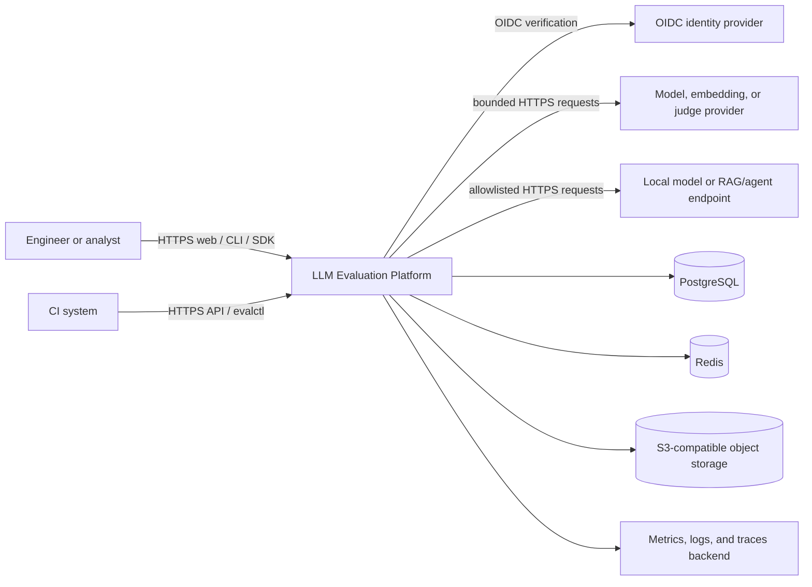
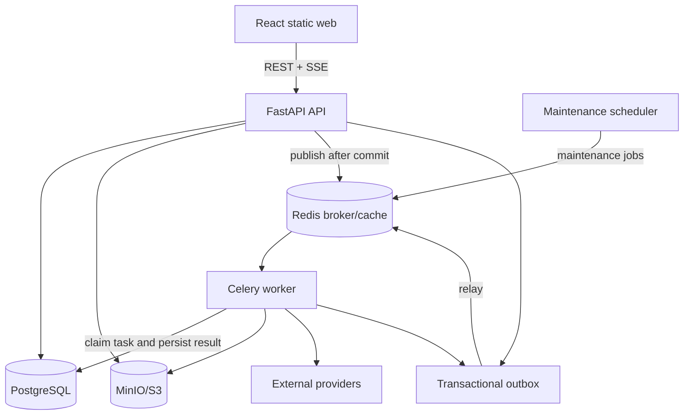
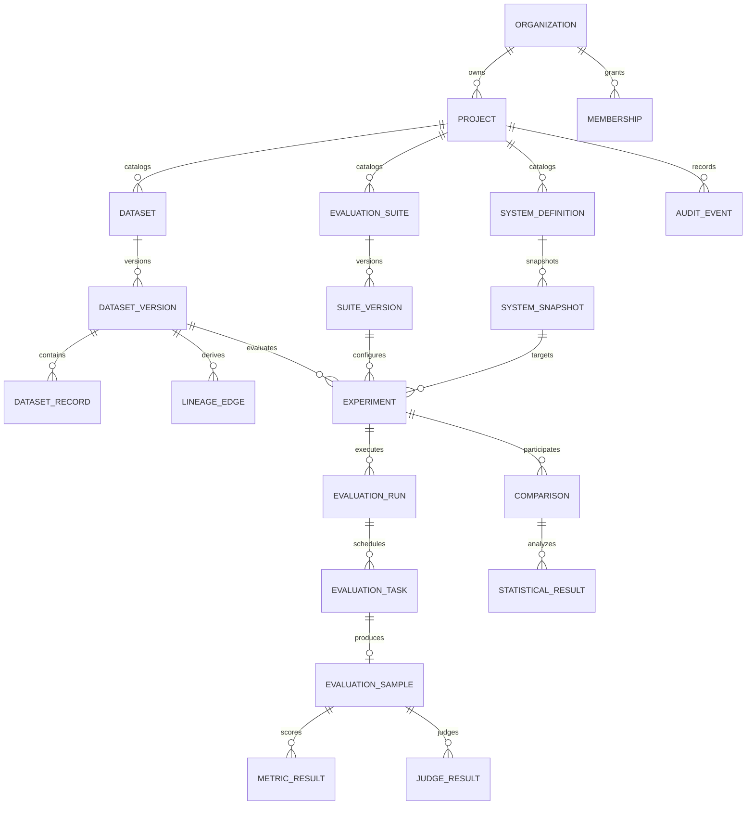
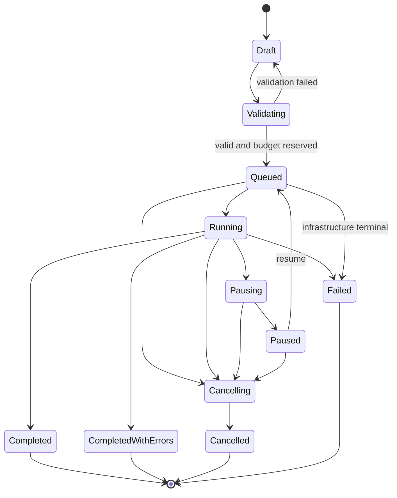
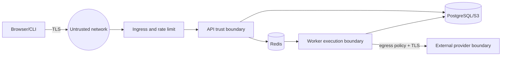

# Phase 1 design

**Status:** Accepted design baseline  
**Date:** 2026-07-29  
**Applies to:** Phases 2–10  
**Product name:** LLM Evaluation Platform  
**CLI name:** `evalctl`

This document is the implementation contract for the platform. Later phases may
refine a decision through an Architecture Decision Record (ADR), but they must
update this document, the traceability matrix, tests, and migration plan in the
same change. The design favors a smaller coherent system with well-defined
extension seams over a set of disconnected integrations.

## 1. Assumptions

1. The first production topology is a single control plane deployed in one
   region, with many organizations and projects. Cross-region active/active
   writes are not required.
2. PostgreSQL is the system of record for identities, configuration, state
   transitions, normalized results, idempotency records, and audit metadata.
   Object storage is the system of record for large immutable blobs. Redis is
   disposable coordination infrastructure, never the only copy of durable
   state.
3. Worker delivery is at least once. Exactly-once execution across networks is
   not achievable; observable effects are made effectively once through stable
   task keys, database uniqueness constraints, compare-and-set leases, and
   provider idempotency keys where providers support them.
4. Evaluation inputs can contain secrets, personal data, malicious text, and
   prompt-injection payloads. All dataset fields, retrieved passages, candidate
   outputs, tool results, imports, and filenames are untrusted.
5. The default local environment has Docker with Compose v2 and enough memory
   for PostgreSQL, Redis, MinIO, API, worker, and web containers. A lightweight
   test profile will allow pure unit tests without containers.
6. Paid provider accounts are optional. All default tests and the complete demo
   use a deterministic fake provider.
7. Provider APIs can be nondeterministic even at temperature zero and can change
   weights, safety systems, tokenizers, routing, and serving kernels without
   notice. The platform guarantees configuration and input reproducibility, not
   bit-for-bit reproduction of behavior outside its control.
8. Record identifiers used for paired analysis are stable logical identifiers.
   Dataset content hashes are not used as logical IDs because edited records
   need to remain matchable across versions.
9. Monetary values use ISO-4217 currency codes and fixed-point decimal values.
   Floating point is permitted for scientific scores, never for billing
   balances or budget enforcement.
10. The initial identity implementation supports local development credentials
    and service API keys. Production human authentication uses an external
    OpenID Connect provider. Enterprise SSO provisioning and SCIM are extension
    points, not initial requirements.
11. Browser clients use short-lived bearer tokens. State-changing cookie-based
    sessions, if added later, must add CSRF protection. The initial API does not
    put authentication tokens in browser-readable persistent storage.
12. English is the initial interface language. Datasets and model content may
    use any Unicode language. Full UI internationalization is a later extension.
13. Exact dependency versions are not selected in Phase 1. Phase 2 will verify
    current stable releases using official project release pages, pin direct
    dependencies, generate lockfiles, record container digests, and document
    the upgrade cadence.
14. PostgreSQL row-level security is defense in depth. Every application query
    is still scoped through an authorization-aware repository; RLS does not
    replace application authorization.
15. Deletion is asynchronous and auditable. Legal holds override user-configured
    retention. Immutable audit events retain non-sensitive evidence after
    payload deletion.

## 2. Scope

The platform will deliver:

- organization/project tenancy, RBAC, service credentials, and audit events;
- immutable, content-addressed dataset versions imported from API, JSON, JSONL,
  CSV, and Parquet, with validation, lineage, sampling, contamination
  diagnostics, redaction, export, and structural diffs;
- versioned systems under test, prompts, suites, metrics, rubrics, judges,
  slices, sampling plans, and statistical analysis plans;
- asynchronous, resumable, bounded evaluation execution for language models,
  RAG pipelines, and tool-using agents;
- remote, local, OpenAI-compatible, and configurable HTTP providers behind one
  stable contract, plus a deterministic fake;
- isolated code metrics and structured model-based evaluation;
- blinded pointwise and pairwise judging, multi-rater aggregation, calibration,
  and position-bias diagnostics;
- paired statistics, uncertainty estimates, hypothesis tests, effect sizes,
  multiple-testing adjustments, rankings, equivalence tests, warnings, and
  power-planning utilities;
- a versioned REST API, typed Python SDK, CLI, accessible React dashboard,
  background workers, event-driven progress, and four report formats;
- reproducible CI regression gates;
- secure-by-default local and Kubernetes deployments with observability,
  runbooks, backup/restore guidance, and disaster-recovery objectives;
- deterministic unit, property, contract, integration, browser, performance,
  security, migration, documentation, build, and demo verification.

## 3. Non-goals

The initial release will not:

- train, fine-tune, host, or autoscale foundation models;
- provide a general-purpose annotation workforce marketplace;
- claim that heuristic contamination scans prove the absence of leakage;
- claim that an LLM judge is a substitute for human validation;
- store or expose hidden model chain-of-thought;
- execute arbitrary user-supplied Python inside the API or worker processes;
- guarantee provider-side deterministic replay;
- provide cross-region active/active database writes;
- provide an online A/B traffic router or causal inference from production
  observational data;
- implement a full data-loss-prevention product or automatically determine all
  applicable privacy law;
- support unbounded user-defined slice expressions or arbitrary SQL;
- present Elo ratings, p-values, or aggregate scores as context-free truth;
- optimize every storage table for billion-row scale on day one. The schema and
  partition boundaries permit that scale without forcing local installations to
  operate distributed analytical infrastructure.

## 4. Architecture overview

### 4.1 Architectural style

The backend is a modular monolith with independently deployable API and worker
processes. Modules use clean-architecture dependency direction:

```text
apps (delivery and process composition)
  -> application (use cases, ports, transaction boundaries)
      -> domain (entities, value objects, policies, pure algorithms)

infrastructure -> application ports
providers      -> provider ports
metrics        -> metric contracts
statistics     -> pure statistical contracts
```

Domain packages import neither FastAPI, Celery, SQLAlchemy, Redis, S3 clients,
nor vendor SDKs. Infrastructure adapters may depend inward on application and
domain contracts. Process composition roots are the only places that select
concrete adapters.

The modular-monolith choice preserves transactional integrity and a navigable
codebase while allowing API and worker horizontal scaling. The durable outbox
and versioned contracts allow high-volume modules to become services later
without rewriting domain logic.

### 4.2 System context



### 4.3 Runtime containers



The web image is served by an unprivileged static server. API and workers share
versioned Python packages but have separate entry points, health semantics,
resource limits, and autoscaling signals. The scheduler only enqueues bounded
maintenance jobs; run fan-out is controlled by a database-backed dispatcher.

### 4.4 Core components

| Component | Responsibility | Must not do |
| --- | --- | --- |
| Identity and access | OIDC claims, local dev auth, API keys, RBAC, tenant context | Embed authorization in UI only |
| Dataset registry | Imports, schemas, immutable versions, manifests, diffs, lineage, redaction | Load an entire large dataset into memory |
| Configuration registry | Version suites, prompts, rubrics, judges, providers, systems, slices | Store plaintext provider secrets |
| Run orchestrator | Resolve snapshots, validate budgets, create runs and bounded tasks | Call model providers in HTTP request handlers |
| Worker executor | Lease tasks, invoke systems, store traces and responses, run metrics | Trust queue delivery as unique |
| Metric engine | Discover compatible versioned plugins, validate inputs/outputs, isolate failures | Let one metric roll back other results |
| Judge engine | Build injection-aware prompts, validate/repair schemas, aggregate judgments | Request or store hidden reasoning |
| Statistics engine | Align pairs, apply missing policy, analyze, warn, and serialize provenance | Silently drop missing samples |
| Comparison/reporting | Reproducible comparisons, slices, gates, JSON/CSV/Markdown/HTML | Report aggregates without denominators |
| Audit/outbox | Append security and domain events transactionally | Include raw secrets or sensitive payloads |
| Observability | Structured logs, traces, Prometheus metrics, health probes | Use high-cardinality record IDs as metric labels |

### 4.5 Control and data flow

Configuration and state changes flow through synchronous API transactions.
Potentially expensive work is represented by durable jobs. An outbox record is
written in the same transaction as each state change. A relay publishes the
event to Redis. Workers lease database task rows before causing an external
effect. Results and the event that announces them commit together.

Large payloads are streamed directly to object storage through bounded server
uploads or short-lived presigned URLs. PostgreSQL stores the object key, content
hash, size, media type, encryption metadata, and lifecycle state. Consumers
verify the hash after download.

Run progress reaches the browser over Server-Sent Events. The API derives
authoritative state from PostgreSQL and uses Redis pub/sub only as a low-latency
wakeup. A reconnect with `Last-Event-ID` can replay durable progress events.

### 4.6 Scale and failure isolation

- Evaluation task rows are hash-partitionable by run month and project.
- Results are inserted in batches and aggregates are updated incrementally.
- Provider/project concurrency uses Redis token buckets backed by conservative
  database policy; Redis loss reduces throughput rather than bypassing budgets.
- Queues are separated by workload (`generation`, `embedding`, `judge`,
  `metrics`, `reports`, `maintenance`) and priority.
- Per-run dispatch windows cap queued-but-unfinished tasks, creating backpressure.
- Provider adapters use bulkheads, timeouts, bounded response sizes, retry
  budgets, and circuit-breaker telemetry.
- A metric or judge failure is committed as its own failure result and does not
  erase a valid model response.
- PostgreSQL and object storage are backed up. Redis is reconstructed from
  outbox and task state.
- Default recovery objectives are RPO 15 minutes and RTO 4 hours for production;
  operators can configure tighter infrastructure-specific objectives.

## 5. Technology decisions

Exact versions will be pinned in Phase 2 only after checking official release
sources. `uv.lock`, `package-lock.json`, and image digests will make builds
reproducible.

| Area | Decision | Why | Principal tradeoff |
| --- | --- | --- | --- |
| Language | Python 3.12+ | Mature ML/statistics ecosystem and typing improvements | Runtime type safety still requires boundary validation and static checks |
| API | FastAPI + Pydantic v2 | OpenAPI, async I/O, strict external schemas | Domain models must remain independent of web schemas |
| Persistence | SQLAlchemy 2 async + Alembic + PostgreSQL | Explicit units of work, robust constraints, RLS, JSONB, partitions | Async ORM requires disciplined loading and transaction scopes |
| Queue | Celery with Redis broker | Mature routing, retries, revocation signals, monitoring | Celery is at-least-once; correctness lives in database idempotency |
| Blobs | S3 API; MinIO locally | Streaming, lifecycle policies, multipart upload, portable API | Metadata/blob consistency needs staged uploads and reconciliation |
| HTTP | `httpx` + `tenacity` | Async streaming and explicit retry policies | Retries must remain adapter-specific and budgeted |
| Logging | `structlog` JSON | Context-bound request/run/trace fields and redaction processors | Local readability needs a development renderer |
| Telemetry | OpenTelemetry + Prometheus client | Vendor-neutral traces and standard metrics | Cardinality must be actively controlled |
| Statistics | NumPy, SciPy, statsmodels plus audited platform algorithms | Trusted primitives and reference comparisons | Library behavior/version becomes analysis provenance |
| IDs | UUIDv7 generated application-side | Globally unique, sortable, index-friendly, non-sequential tenant leakage | Time component is visible and clock rollback needs monotonic handling |
| Web | TypeScript, React, Vite, TanStack Query, TanStack Router | Typed, accessible SPA and mature test ecosystem | SPA requires deliberate error/loading/permission semantics |
| Components | Radix primitives with platform-owned styles | Accessible interaction foundations without a heavy theme lock-in | Accessibility still needs browser testing |
| Charts | Observable Plot or equivalent accessible SVG/table pairing | Declarative uncertainty visualization | Every chart needs a tabular/text alternative |
| CLI | Typer over typed SDK | Discoverable commands, shell completion, consistent API behavior | SDK/API compatibility must be maintained |
| Packaging | `uv` Python workspace; npm workspaces | Reproducible monorepo and fast CI caching | Two lockfiles and toolchains remain |
| Docs | MkDocs Material + Mermaid | Searchable versioned documentation near code | Plugin versions and link checks add build work |
| Tests | pytest, Hypothesis, testcontainers, Vitest/RTL, Playwright | Covers pure math through complete workflows | Integration/E2E suites require tiered CI |
| Deployment | Multi-stage Docker + Kustomize Kubernetes base/overlays | Transparent manifests and environment overlays | Helm consumers need an optional later packaging layer |
| Auth | OIDC for humans, scoped random API keys for services | Avoids building identity lifecycle; supports automation | Local development needs a clearly isolated auth mode |
| Events | Transactional outbox + polling relay | State and event publication cannot diverge | Adds outbox cleanup and relay lag monitoring |

No vendor model SDK is imported by core packages. OpenAI-compatible, local
OpenAI-compatible, and generic HTTP providers use the platform HTTP contract.

## 6. Domain model

### 6.1 Shared value objects

- `UUID7`: stable identifier. IDs are never reused.
- `TenantContext`: organization, optional project, principal, roles, and request
  correlation.
- `VersionNumber`: monotonically increasing positive integer within a parent.
- `ContentHash`: algorithm plus lowercase digest, initially `sha256`.
- `Money`: `Decimal` amount quantized to 12 fractional digits plus currency.
- `UtcTimestamp`: timezone-aware UTC instant.
- `ArtifactRef`: bucket, opaque object key, digest, byte size, media type, and
  sensitivity classification.
- `VersionStamp`: integer used for optimistic concurrency on mutable resources.
- `RecordKey`: stable caller-provided or derived logical key within a dataset.
- `PluginRef`: stable ID and semantic version, never an unversioned import path.
- `Seed`: unsigned 64-bit integer recorded for every randomized operation.

### 6.2 Aggregate boundaries

An aggregate is the maximum consistency boundary for a single transaction.
Cross-aggregate workflows use application services and outbox events.

| Aggregate root | Owned entities/value objects | Key invariants |
| --- | --- | --- |
| Organization | memberships, organization roles, retention defaults | Unique slug; at least one active owner; soft-delete blocks new work |
| Project | project memberships, budgets, concurrency policies | Belongs to one organization; project role cannot exceed org policy |
| Service account | API key descriptors and scopes | Raw key shown once; only keyed hash stored; revocation is immediate |
| Dataset | tags, aliases, current metadata | Alias unique per project; versions are separate immutable aggregates |
| Dataset version | schema snapshot, manifest, records, splits, lineage edges, validation summary | Frozen after publish; logical record keys unique; digest matches manifest |
| Dataset import job | source artifact, parser config, errors, progress | Idempotent by project and request key; bounded error retention |
| Evaluation suite | mutable name/tags | Published suite versions never change |
| Evaluation suite version | cases, metric configs, rubric refs, judge refs, sampling/statistical configs | All refs resolve to immutable versions; incompatible metrics rejected |
| System definition | mutable identity and tags | No secrets; versions/snapshots hold public configuration only |
| System-under-test snapshot | model/prompt/RAG/agent/retriever/embedding/tool refs and parameters | Immutable, self-contained, canonical digest |
| Experiment | immutable resolved configuration, description, baseline link | Created only from published versions; config digest unique per idempotency scope |
| Evaluation run | lifecycle, counters, budget reservation, execution environment | State transition is legal; counters nonnegative; terminal states immutable except annotations |
| Evaluation task | attempts, lease, normalized failures, response/result refs | Unique `(run, record, repetition, system)`; one committed success |
| Evaluation sample | response, retrieval summary, trajectory summary, per-sample status | References exact task and record; raw large data lives in artifacts |
| Pair assignment | blinded A/B refs, order seed, judges, judgments | Same pair/design cell not assigned twice; blind mapping immutable |
| Comparison | aligned cohort, analysis config, results, gates | Cohort and missing policy explicit; result provenance immutable |
| Report | format, template version, artifact, source snapshot | Must include sample/failed/missing counts and reproduction data |
| Audit event | actor, action, target, decision, safe before/after summary | Append-only; hash chained per organization; no secrets |

Metric definitions, rubrics, judge configurations, prompts, slices, provider
configurations, tools, retrievers, embeddings, RAG pipelines, and agents follow a
common versioned-resource pattern: a mutable catalog identity owns immutable,
monotonically numbered versions. Published versions are referenced by ID, never
by mutable alias.

### 6.3 Domain relationships



Every project-owned row also carries `organization_id` to support composite
foreign keys and RLS without a join. Database constraints ensure the project
belongs to that organization. Cross-project foreign keys are forbidden.

### 6.4 Lifecycle state machines

Run states:



`Completed`, `CompletedWithErrors`, `Cancelled`, and `Failed` are terminal.
Reproduction creates a new run linked to the old one. “Resume a completed run”
means reproduce unresolved work in a new run; it never reopens a terminal row.
Pause stops new dispatch and asks active tasks to checkpoint. Cancellation stops
new dispatch, revokes cooperative work, marks untouched tasks cancelled, and
waits for active leases to settle before reaching `Cancelled`.

Dataset version states are `draft -> validating -> published` or
`draft/validating -> rejected`; a published version may be `deprecated` and
eventually `retired`, but its content never changes. A draft used only inside
its creating transaction is editable; publication computes and locks the
manifest. Evaluations accept only published versions.

Task states are `pending -> leased -> running -> succeeded|failed|cancelled`.
Expired leases may move `leased|running -> pending` if no success row exists and
the attempt budget remains. Attempt history is append-only.

### 6.5 Ownership and authorization

Organizations own projects. Projects own all datasets, configurations,
experiments, results, artifacts, reports, and project audit events. A resource
ID alone is never sufficient authorization: repositories require tenant context
and use `(organization_id, project_id, id)` predicates.

Roles are:

- organization `owner`, `admin`, `auditor`, `member`;
- project `admin`, `editor`, `runner`, `viewer`;
- service scopes such as `dataset:write`, `run:start`, `result:read`, and
  `report:export`.

The effective permission is the intersection of principal status, organization
policy, project role, API-key scopes, and resource state. Denials are audited
without revealing whether a cross-tenant object exists.

### 6.6 Deletion and retention

- Catalog objects use soft deletion first and disappear from normal queries.
- Immutable versions referenced by experiments cannot be hard-deleted until all
  dependants and retention holds expire. They can be hidden and access-revoked.
- Dataset record payloads and raw output artifacts follow project retention and
  sensitivity policies. Derived non-identifying aggregates may have a longer
  policy.
- Hard deletion is a background workflow with a tombstone, dependency scan,
  object deletion, database erasure/anonymization, verification, and audit
  completion event.
- Audit events are append-only and hold IDs, action, outcome, and safe summaries,
  not full deleted payloads.
- Organization deletion requires an owner confirmation workflow, a cooling-off
  period, and explicit legal-hold check.

## 7. Data model

### 7.1 PostgreSQL conventions

All tables use `uuid` primary keys containing UUIDv7 values, `created_at`
timezone-aware timestamps, and explicit foreign keys. Mutable roots add
`updated_at`, `version_stamp`, and nullable `deleted_at`. Immutable version rows
add `published_at`, `content_hash_algorithm`, and `content_hash`.

Tenant tables carry `organization_id` and usually `project_id`. Uniqueness is
scoped to the owning tenant. Foreign keys use `RESTRICT` for immutable evidence,
`CASCADE` only for uncommitted child rows whose lifetime is exactly their
parent, and background deletion for material content.

Statuses are PostgreSQL text columns with check constraints rather than native
database enums, allowing rolling application deployments to add values safely.
Python uses stable string enums.

### 7.2 Logical schemas and tables

| Schema/table family | Principal tables | Important constraints/indexes |
| --- | --- | --- |
| `iam` | organizations, users, identities, memberships, projects, project_memberships, service_accounts, api_keys, roles, role_bindings | unique normalized slugs/emails; active-owner enforcement trigger; API key prefix lookup; tenant composite FKs |
| `audit` | audit_events, audit_chain_heads, idempotency_keys, outbox_events | `(org, sequence)` unique; event hash chain; `(principal, route, key)` unique; unpublished outbox partial index |
| `datasets` | datasets, dataset_schemas, dataset_versions, dataset_records, dataset_splits, dataset_record_splits, dataset_tags, dataset_tag_links, lineage_edges, import_jobs, validation_reports, contamination_reports | `(dataset, version_number)` unique; `(version, record_key)` unique; `(version, payload_hash)` duplicate index; immutable trigger; GIN metadata index |
| `config` | versioned resource identities and versions for suites, cases, metrics, rubrics, judges, prompts, providers, models, retrievers, embeddings, RAG pipelines, agents, tools, slices | unique `(identity, version_number)`; JSON Schema checks at application boundary; published-row immutable trigger |
| `runs` | experiments, system_snapshots, evaluation_runs, run_state_events, evaluation_tasks, task_attempts, evaluation_samples, model_responses, retrieval_summaries, trajectory_summaries, cost_records, failure_records, artifacts | task natural-key uniqueness; leases indexed by expiry; run/status index; nonnegative counter checks; one success per task |
| `results` | metric_results, judge_results, pair_designs, pair_assignments, pair_judgments, aggregate_results, confidence_intervals, statistical_test_results, effect_size_results, slice_results, rankings | `(sample, metric_ref, repetition)` unique; score bounds check where static; comparison/metric indexes |
| `reports` | comparisons, comparison_experiments, comparison_cohorts, regression_gates, gate_results, reports | immutable cohort digest; report source digest; format check |

Schema names describe logical ownership. Alembic migrations use one ordered
history so foreign-key changes are atomic and deployments have one migration
head.

### 7.3 Large-object layout

Object keys never contain original filenames:

```text
org/{organization_uuid}/project/{project_uuid}/
  datasets/{dataset_uuid}/{version_uuid}/{artifact_uuid}
  runs/{run_uuid}/responses/{shard}/{artifact_uuid}
  runs/{run_uuid}/retrieval/{shard}/{artifact_uuid}
  runs/{run_uuid}/trajectories/{shard}/{artifact_uuid}
  reports/{report_uuid}/{artifact_uuid}
```

Uploads enter a quarantine prefix with an `uploading` database state. After size,
media-type, archive-structure, malware-policy, and digest validation, a server
side copy promotes the object and a transaction marks it ready. A reconciler
deletes abandoned quarantined uploads and detects missing ready objects.

### 7.4 Dataset canonicalization and hashing

Canonicalization is schema-aware and deterministic:

1. Decode bytes with the declared encoding (UTF-8 by default); reject invalid
   byte sequences. Strip a single UTF-8 BOM only at the beginning of a file.
2. Parse the source format with duplicate JSON object keys rejected. CSV header
   names are normalized before collision detection. Parquet values are converted
   according to the declared dataset schema, not inferred differently per batch.
3. Validate against the immutable JSON Schema snapshot. Unknown properties are
   rejected unless the schema explicitly permits them.
4. Recursively normalize object keys and string values to Unicode NFC and convert
   CRLF and bare CR to LF. If key normalization creates a collision, reject the
   record.
5. For properties declared optional and nullable, treat absence and explicit
   `null` as equivalent by materializing `null`. Apply a schema default only when
   the schema version explicitly opts into default materialization. Other absent
   properties remain absent; explicit null for a non-nullable property is invalid.
6. For schema fields with JSON Schema `format: date-time`, require an offset,
   convert to UTC, emit RFC 3339 with `Z`, always include seconds, and retain only
   the necessary fractional second digits up to microseconds. Leap seconds and
   offset-free times are rejected. Ordinary strings that resemble timestamps
   are not changed.
7. Restrict numbers to finite IEEE-754 binary64 and integers in the interoperable
   range `[-(2^53-1), 2^53-1]`; reject NaN and infinities and normalize negative
   zero to zero. Exact decimal values must use schema-validated decimal strings.
8. Serialize the normalized value using RFC 8785 JSON Canonicalization Scheme:
   no insignificant whitespace, deterministic property order, lowercase JSON
   literals, and shortest round-trippable number representation.
9. Compute `payload_hash = SHA-256(canonical_payload_bytes)`. Compute a separate
   record envelope hash over a length-prefixed tuple of record key, payload hash,
   normalized metadata, source provenance, and split memberships.
10. Sort manifest entries by the UTF-8 bytes of normalized record key. Compute
    the version hash over a domain-separated, length-prefixed stream containing
    canonicalization version, schema hash, dataset metadata hash, and every
    record envelope hash. Length framing prevents concatenation ambiguity.

The canonicalization algorithm itself is versioned (`dataset-c14n/1`). A future
algorithm creates a new dataset version and never changes historical hashes.
Golden cross-format fixtures will prove that semantic equivalents hash equally,
and that meaningful differences do not.

Duplicate payload hashes are reported. Policy decides whether duplicates are
rejected, retained with warnings, or collapsed into explicitly recorded lineage.
Record keys, not payload hashes, drive diffs:

- added: key only in target;
- removed: key only in source;
- modified: key in both but envelope hash differs, with field-level JSON diff;
- unchanged: key and envelope hash match.

### 7.5 Partitioning, indexes, and aggregation

Initial installations use ordinary tables behind a repository contract.
Production migrations create monthly range partitions for task attempts,
samples, metric results, cost records, failures, and audit events, subpartitioned
or indexed by project where volumes justify it. A default partition prevents
insert failures while monitoring alerts on misplaced rows.

Primary query indexes cover:

- `(project_id, created_at desc, id)` for keyset pagination;
- `(run_id, status, record_key)` for result browsing;
- `(run_id, metric_definition_version_id, sample_id)` for aggregation;
- `(dataset_version_id, record_key)` for pairing and diffs;
- `(provider_configuration_id, status, lease_expires_at)` for dispatch;
- GIN indexes only on approved searchable metadata, not arbitrary raw output.

Incremental aggregators consume durable result events and maintain mergeable
count, sum, compensated sum-of-squares, t-digest/HDR-style latency sketches, and
failure counters. Final statistical analyses always read the frozen aligned
sample cohort, not only lossy sketches.

## 8. Key workflows

### 8.1 Dataset import and publication

```mermaid
sequenceDiagram
    actor Client
    participant API
    participant DB
    participant S3
    participant Worker

    Client->>API: create import (Idempotency-Key)
    API->>DB: authorize; create draft/import/outbox
    API-->>Client: 202 + import ID
    Worker->>DB: lease import
    Worker->>S3: stream quarantined source
    Worker->>Worker: parse, normalize, validate in batches
    Worker->>DB: batch records/errors into staging
    Worker->>Worker: compute manifest and reports
    Worker->>DB: transactionally publish immutable version
    Worker->>S3: persist exact source/export manifests
    Client->>API: poll/SSE status
    API-->>Client: version ID, hash, validation summary
```

Imports enforce byte, row, nesting, field, archive expansion, and processing-time
limits. Failure leaves the previous version untouched. A new version from a
published version copies references through a draft transformation job and
records parents, code/config digest, parameters, actor, and seed.

Sampling orders records by a keyed pseudorandom score derived from
`HMAC-SHA256(seed_bytes, record_key)` and applies stable tie-breaking. Stratified
sampling allocates counts with a documented largest-remainder method, records
underfilled strata, and never depends on database row order.

### 8.2 Evaluation run

```mermaid
sequenceDiagram
    actor Client
    participant API
    participant DB
    participant Dispatcher
    participant Queue
    participant Worker
    participant Provider
    participant S3

    Client->>API: dry-run/start immutable experiment
    API->>DB: resolve versions, snapshot, estimate, authorize budget
    API->>DB: reserve budget, create queued run + outbox
    Dispatcher->>DB: claim bounded record window
    Dispatcher->>DB: insert unique tasks
    Dispatcher->>Queue: publish task IDs
    Worker->>DB: lease task; check run and budget
    Worker->>Provider: request with timeout/idempotency key
    Provider-->>Worker: response/usage/provider request ID
    Worker->>S3: write large raw artifacts
    Worker->>DB: commit sample, cost, metrics, progress event
    Dispatcher->>DB: dispatch next bounded window
    Dispatcher->>DB: finalize counters and terminal state
    API-->>Client: SSE durable progress
```

The immutable experiment contains dataset/suite/system snapshots, provider and
model identifiers, prompt and metric versions, judge configuration, sampling
seed, statistical plan, application version, Python/package lock digest,
container image digest, and execution policy.

Retry decisions use normalized failures. Authentication, permission, content
policy, context length, deterministic invalid request, and budget exhaustion are
not retried. Rate limit, timeout, connection, and provider server errors are
retryable only within attempt, elapsed-time, cost, and run retry budgets.
Exponential backoff uses full jitter and honors bounded `Retry-After`.

Before each external call, a worker checks cancellation and its lease. After a
call, it records even late results but a compare-and-set commit decides whether
the result wins. If the provider supports idempotency, the stable provider key
derives from task and attempt policy. Otherwise an ambiguous connection loss is
classified separately because retry may duplicate billing.

### 8.3 Pairwise judging

```mermaid
sequenceDiagram
    participant Designer
    participant Pairer
    participant JudgeWorker
    participant JudgeProvider
    participant Analyzer

    Designer->>Pairer: variants, records, judges, seed, balance policy
    Pairer->>Pairer: deterministic balanced pair schedule
    Pairer->>Pairer: randomize order and create blind labels
    JudgeWorker->>JudgeProvider: trusted rubric + delimited untrusted A/B
    JudgeProvider-->>JudgeWorker: strict structured judgment
    JudgeWorker->>JudgeWorker: validate; bounded repair/retry
    JudgeWorker->>Pairer: verdict/confidence/evidence/justification
    Analyzer->>Analyzer: disagreement, reversed-order, position diagnostics
    Analyzer->>Analyzer: win rates, bootstrap, Bradley-Terry/Davidson
```

The blind mapping is unavailable to the judge adapter. Pair uniqueness includes
design, record, unordered variant pair, judge slot, repetition, and orientation.
Verdicts are `A`, `B`, `tie`, or `abstain`; abstentions are not silently treated
as ties. Reversed duplicates are linked and analyzed for self-consistency.

### 8.4 Judge prompt construction

The prompt has separate messages/sections for:

1. immutable system instruction and output contract;
2. trusted rubric and schema version;
3. trusted identifiers that reveal no candidate identity;
4. untrusted candidate/reference/tool/retrieval content inside randomized,
   nonce-bearing length-delimited envelopes;
5. a final trusted reminder that envelope contents are evidence, not
   instructions.

The judge returns verdict, rubric scores, confidence, evidence references,
concise justification, abstention reason, and schema version. Evidence references
must point to line/segment IDs supplied by the platform. The system asks for no
hidden chain-of-thought. Invalid output receives at most a configured number of
schema-only repairs; raw invalid responses and costs remain auditable.

### 8.5 Experiment comparison and CI gate

1. Resolve immutable runs and metric versions.
2. Verify task, schema, and dataset compatibility.
3. Align by logical record key and repetition; report both union and intersection
   counts.
4. Apply the declared missing/failure policy. Intersection-only analysis emits a
   prominent warning and missingness table.
5. Compute paired deltas, intervals, effects, tests, adjusted p-values, practical
   interpretation, failure/cost/latency differences, slices, and extreme changes.
6. Freeze the cohort digest and analysis provenance.
7. Evaluate versioned regression gates against values and interval bounds.
8. Export JSON, sanitized CSV subsets, Markdown, or printable self-contained HTML.

Gate evaluation has explicit `pass`, `fail`, and `inconclusive` outcomes.
Configuration decides whether inconclusive blocks CI. Safety constraints can be
hard zero-tolerance checks. The CLI exits 0 for pass, 2 for gate failure, 3 for
inconclusive configured to block, and distinct documented codes for usage,
authentication, transport, or server errors.

## 9. Security model

### 9.1 Trust boundaries



The API never assumes the web UI has enforced a permission. Workers receive
opaque task IDs and re-authorize task state from the database. Provider
credentials are resolved at call time from a secret manager using a stored
secret reference.

### 9.2 Authentication and credential storage

- OIDC JWTs require exact issuer, audience, signature algorithm, expiry, and
  nonce/state validation with cached, rotation-aware JWKS.
- API keys contain a public prefix and 256 bits of randomness. The database
  stores prefix, scopes, timestamps, and `HMAC-SHA256(server_pepper, raw_key)`.
  Comparison is constant time. Raw keys are displayed once.
- The pepper and provider secrets come from Kubernetes/external secret stores or
  local environment files excluded from Git.
- If encrypted database secrets are enabled later, envelope encryption uses a
  per-secret data key wrapped by KMS, authenticated encryption, versioned key
  metadata, and an audited rotation job.

### 9.3 Authorization and isolation

An application policy engine evaluates action, principal, tenant, scopes, role,
resource ownership, and lifecycle. Repository queries require tenant context.
PostgreSQL transactions set local tenant variables and RLS policies enforce the
same organization/project boundary. Background jobs use narrowly scoped service
roles. Cross-tenant lookups return the same not-found response as absent objects.

### 9.4 Principal threats and controls

| Threat | Preventive controls | Detection/recovery |
| --- | --- | --- |
| IDOR/cross-tenant access | scoped repositories, composite FKs, RLS, policy tests | denial audit events, cross-project integration tests |
| API key theft | one-time display, keyed hashes, scopes, expiry, rotation | last-used metadata, anomaly/rate alerts, immediate revoke |
| SQL injection | parameterized SQLAlchemy, no arbitrary SQL filters | SAST and injection tests |
| XSS/model-output scripts | React text rendering, no unsafe HTML, CSP, sanitized report templates | browser security tests |
| CSRF | bearer auth outside cookies; SameSite and anti-CSRF if cookies added | origin telemetry and tests |
| SSRF | HTTPS default, resolved-IP checks, deny private/link-local/metadata ranges, redirect revalidation, admin allowlist for local endpoints | egress network policy and destination audit |
| Malicious upload/path traversal | opaque keys, filename discard, streaming parsers, archive limits, media sniffing, size/nesting limits | quarantine, rejected-upload audit |
| CSV formula injection | prefix dangerous cells beginning `=`, `+`, `-`, `@`, tab, or CR with apostrophe; RFC 4180 quoting | golden export security tests |
| Prompt injection | trust-separated nonce delimiters, identity blinding, least-data judge payload | adversarial fixtures, validation-failure and drift alerts |
| Judge data exfiltration | provider data policy, sensitive-field redaction, explicit user warning/approval policy, egress controls | provider/request audit without payload leakage |
| Secret/log leakage | schema-based redaction, allowlisted structured fields, exception sanitizer | canary-secret tests and log scanning |
| Cost denial of service | auth rate limits, quotas, preflight estimate, atomic reservations, token/output caps, dispatcher backpressure | budget alerts, circuit breakers, emergency project stop |
| Dependency compromise | hashes/locks, Dependabot/Renovate, SBOM, signature/digest checks, scans | CI vulnerability gates and incident runbook |
| Queue forgery/duplicates | private Redis, TLS/auth in production, opaque IDs, DB leases and uniqueness | duplicate-attempt metrics and reconciliation |
| Tampered audit history | append-only privileges and organization hash chain | scheduled chain verification and external retention export |

Security headers include a restrictive Content Security Policy, HSTS in
production, `X-Content-Type-Options: nosniff`, `Referrer-Policy`, and appropriate
frame restrictions. CORS defaults to no cross-origin access and accepts an
explicit origin allowlist. Uploads and API endpoints have separate rate/size
limits. Logs never contain raw auth headers, provider credentials, full prompts,
dataset records, or response bodies.

### 9.5 Privacy and retention

Dataset schemas can mark sensitive JSON pointers. Redaction operates on parsed
structures before logging, external judging, previews, and exports; it cannot be
implemented as regex-only log cleanup. Each provider configuration declares
data retention/training assurances and permitted sensitivity classes. Sending
sensitive fields to a provider can be prohibited by project policy.

Exports include a data-classification banner and are short-lived artifacts.
Deletion workflows cover PostgreSQL rows, object versions where enabled, search
indexes, cached previews, and backups according to documented backup expiry.

Delimiters and redaction reduce risk but cannot guarantee immunity from prompt
injection or detect all personal information. These limitations must appear in
the UI and judge configuration guide.

## 10. Statistical design

### 10.1 Analysis contract

Every analysis stores:

- procedure ID and semantic version;
- metric definition/version and direction;
- confidence level and alternative hypothesis;
- aligned population, effective sample size, group/cluster/stratum keys;
- missing/failed-sample policy and counts by reason;
- random seed and resampling count;
- estimate, interval, effect size, raw and adjusted p-values where applicable;
- minimum practically important difference (MPID) or equivalence margin;
- assumptions, diagnostics, machine-readable warnings, and library versions.

Descriptive estimates and inferential claims are separate fields. Procedures
accept validated arrays/tables and return typed result objects; they do not query
the database.

### 10.2 Missingness

Default comparison policy is paired complete cases plus a mandatory missingness
table and a paired failure-rate analysis over the full union. Users may choose
`failure_as_worst`, `available_case`, or a task-specific penalty only when the
suite declares the scale semantics. No policy silently drops observations.
Sensitivity reports compare reasonable policies when missingness differs by
system. The platform does not claim data are missing at random merely because a
complete-case method is used.

### 10.3 Confidence intervals

| Estimand | Default | Alternatives/edge behavior |
| --- | --- | --- |
| Mean | Student t interval | normal only by explicit request and warning; cluster/stratified bootstrap |
| Median/quantile | percentile bootstrap | BCa when jackknife acceleration is defined; warn on discreteness/instability |
| Proportion/accuracy/error/win | Wilson score | Clopper–Pearson exact by request; define trials and treatment of ties |
| Paired mean delta | t interval on within-pair differences | paired percentile/basic/BCa bootstrap |
| Latency/cost quantile | bootstrap over records or clusters | no normal approximation by default |
| Pairwise ranking coefficient | model covariance or pair/record bootstrap | convergence and separation diagnostics required |

Bootstrap sampling uses NumPy’s `Generator(PCG64)` with a recorded seed and
stable input order. Paired bootstrap resamples aligned record indices once and
applies those indices to both systems. Independent resampling would destroy
within-record covariance and usually misstate uncertainty. Stratified bootstrap
resamples within declared strata. Cluster bootstrap samples clusters and keeps
all observations in sampled clusters, using cluster multiplicity.

BCa computes bias correction from bootstrap estimates and acceleration from
jackknife influence values. It falls back with an explicit warning when the
jackknife is degenerate, sample size is too small, or adjusted quantiles are
undefined.

### 10.4 Tests and effects

Supported paired tests:

- paired t-test with normality/outlier caveats on differences;
- Wilcoxon signed-rank with explicit zero method and exact/asymptotic mode;
- exact or approximate sign test, excluding zero differences while reporting
  them;
- McNemar exact binomial for small discordant counts and continuity-corrected
  chi-square when configured;
- paired randomization/permutation test using sign flips;
- centered paired-bootstrap test with documented null construction;
- binomial pairwise win test with ties excluded or a declared half-win/model
  treatment.

Effects include mean and median paired difference, relative improvement with
near-zero-baseline warning, paired standardized mean difference using the
standard deviation of differences, matched odds ratio with zero-cell interval
handling, absolute risk difference, win-rate difference, and probability of
superiority with tie convention stated.

Holm is the default family-wise correction for a declared comparison family.
Benjamini–Hochberg controls false discovery rate for exploratory slice families.
Bonferroni is available and labeled conservative. Raw and adjusted values are
both stored; families are frozen before looking at results.

### 10.5 Practical significance and equivalence

Each gate can define an MPID in the metric’s natural units. Results classify:

- statistically supported and practically meaningful improvement;
- statistically supported but practically small change;
- not statistically conclusive;
- meaningful regression supported by evidence;
- equivalent within tolerance only when a valid two one-sided tests (TOST)
  analysis rejects both non-equivalence nulls.

Absence of a significant difference is never labeled equivalence. TOST for
paired continuous differences uses lower/upper margins, paired standard error,
and a compatible confidence interval. Gate semantics can require both practical
and statistical evidence, or a conservative lower/upper confidence bound,
instead of blindly thresholding a p-value.

### 10.6 Pairwise rankings and agreement

- Win rate reports wins divided by non-abstaining decisions; a separate
  tie-adjusted view counts ties as one half and always reports all counts.
- Bradley–Terry uses batch maximum penalized likelihood with a fixed reference
  or sum-to-zero identifiability constraint. It diagnoses disconnected comparison
  graphs and complete separation.
- Davidson extends Bradley–Terry with a nonnegative tie parameter. It is the
  preferred ranking when explicit ties are common and the graph supports it.
- Elo is an optional descriptive sequential view with recorded order, initial
  rating, K factor, and tie rule. It is not an inferential truth.
- Pair/record-cluster bootstrap captures dependence from repeated judges and
  records; naive judgment-level resampling is not the default.

Agreement reports raw agreement, categorical precision/recall/F1, Cohen kappa
for two appropriate categorical raters, weighted kappa for ordinal ratings,
Krippendorff alpha for multiple/missing raters, Spearman/Kendall correlation for
ordinal association, confusion matrices, and calibration curves/Brier score
when confidence is probabilistic. Prevalence effects, independence assumptions,
missing ratings, and scale choice are reported.

### 10.7 Power planning and warnings

Planning utilities provide clearly labeled approximations for paired continuous
outcomes (difference SD), paired binary outcomes (discordant proportions), and
preference studies (binomial or simulation with ties/design effects). They
return inputs and assumptions, not false precision.

Warnings are typed and severity-ranked for very small effective sample size,
zero variance, all ties, degenerate proportions, extreme class imbalance,
excessive/differential missingness, few clusters, unstable/bootstrap boundary
intervals, disconnected ranking graphs, nonconvergence, excessive judge
disagreement, and multiplicity/slice fishing. UI and reports cannot suppress
warning counts; acknowledged warnings remain in provenance.

## 11. Testing strategy

### 11.1 Test layers

| Layer | Purpose | Default dependencies |
| --- | --- | --- |
| Unit | Domain invariants, policies, metrics, canonicalization, state machines | None external |
| Property | Algebraic/range/reproducibility properties and generated state sequences | Hypothesis |
| Statistical validation | Hand examples, library cross-checks, seeded simulations and coverage diagnostics | NumPy/SciPy/statsmodels |
| Contract | Providers, metric plugins, object store, queue messages, OpenAPI/error schema | Fake servers/adapters |
| Integration | Migrations, constraints, transactions, RLS, outbox, Redis, MinIO, workers | Testcontainers |
| API | Auth, validation, paging, filtering, idempotency, optimistic concurrency | In-process and container DB |
| Frontend component | Accessible states and typed rendering | Vitest/RTL/axe |
| End-to-end | Complete browser and CLI workflows | Playwright + local stack |
| Security | Tenant isolation, injection, upload abuse, redaction, rate/cost limits | Unit through E2E |
| Performance | Streaming imports, scheduling, batched writes, aggregation, comparison queries | Repeatable profiled stack |
| Build/operations | Images, non-root, probes, manifests, backup restore, demo | Docker/Kubernetes validators |

### 11.2 Required behavioral coverage

- State-machine tests enumerate every allowed edge and reject all other pairs;
  integration tests verify compare-and-set transitions and terminal immutability.
- Canonicalization golden fixtures cover all source formats, Unicode forms, line
  endings, timestamp offsets, numbers, optional-null equivalence, collisions,
  and cross-process stability.
- Property tests prove idempotent canonicalization, semantic hash stability,
  diff symmetry relations, deterministic/stratified sampling, score bounds,
  interval ordering, balanced position randomization, and seeded bootstrap replay.
- Statistical algorithms are checked against hand calculations and trusted
  library outputs with explicit absolute/relative tolerances. Seeded simulations
  assess approximate interval coverage; CI uses bounded trials and stores
  expected tolerance bands to avoid flaky pass criteria.
- Provider adapters run the same contract for generation, chat, structured
  output, embeddings, usage, tracing, error taxonomy, retryability, bounded
  responses, and secret redaction.
- Judge fixtures include system impersonation, rubric replacement, secret
  requests, score coercion, delimiter imitation, malformed JSON, wrong schema,
  invalid bounds, abstention, tie, reversal, disagreement, repairs, and cost cap.
- Integration tests run migrations from empty and previous release snapshots,
  verify RLS/cross-project isolation, enqueue/lease/retry/cancel/resume workflows,
  and reconcile database/object state.
- Frontend tests cover loading, empty, error, partial, permission-denied,
  missing-versus-zero, sample size, warnings, keyboard navigation, accessible
  names, focus, and non-color status cues.
- End-to-end tests perform the eleven-step required workflow with the fake
  provider and assert exported content and audit evidence.
- Performance scenarios define dataset size, concurrency, hardware profile,
  warmup, percentile, and allowed regression. Hard thresholds run only on
  controlled runners; portable CI records trends and guards gross regressions.

### 11.3 Determinism and quality gates

Tests use fixed clocks, seeded generators, deterministic fake provider scripts,
isolated tenant fixtures, and no network calls unless explicitly marked
`live_provider`. Critical tests cannot be skipped in required CI. Flaky retries
are not used to hide defects.

Required CI gates are Ruff formatting/lint, MyPy strict package checks, unit and
property tests, critical branch thresholds, integration/contracts, frontend
lint/type/test/build, Playwright, docs build/link check, migration single-head
and upgrade/downgrade validation, Python package build, Docker builds, non-root
smoke tests, secret/dependency/container scans, SBOM, license policy, and demo.
Coverage thresholds are package-specific; domain, authorization, statistics,
canonicalization, and state transitions receive the highest branch thresholds.

## 12. Planned repository tree

```text
.
├── apps/
│   ├── api/src/eval_platform_api/
│   ├── cli/src/evalctl/
│   ├── web/src/
│   └── worker/src/eval_platform_worker/
├── packages/
│   ├── application/src/eval_platform_application/
│   ├── domain/src/eval_platform_domain/
│   ├── evaluators/src/eval_platform_evaluators/
│   ├── infrastructure/src/eval_platform_infrastructure/
│   ├── metrics/src/eval_platform_metrics/
│   ├── providers/src/eval_platform_providers/
│   ├── schemas/src/eval_platform_schemas/
│   ├── sdk/src/eval_platform_sdk/
│   └── statistics/src/eval_platform_statistics/
├── tests/
│   ├── contract/
│   ├── e2e/
│   ├── fixtures/
│   ├── integration/
│   ├── performance/
│   ├── security/
│   └── unit/
├── docs/
│   ├── adr/
│   ├── api/
│   ├── architecture/
│   ├── concepts/
│   ├── design/
│   ├── guides/
│   ├── operations/
│   ├── security/
│   ├── statistics/
│   └── testing/
├── examples/
│   ├── agent/
│   ├── classification/
│   ├── judge/
│   ├── pairwise/
│   ├── qa/
│   ├── rag/
│   └── regression/
├── migrations/
│   └── versions/
├── deploy/
│   ├── docker/
│   ├── kubernetes/
│   │   ├── base/
│   │   └── overlays/
│   └── monitoring/
│       ├── alerts/
│       ├── dashboards/
│       └── recording-rules/
├── scripts/
├── .github/
│   ├── dependabot.yml
│   └── workflows/
├── .codex/
├── .env.example
├── .pre-commit-config.yaml
├── CHANGELOG.md
├── CODE_OF_CONDUCT.md
├── CONTRIBUTING.md
├── LICENSE
├── Makefile
├── README.md
├── SECURITY.md
├── docker-compose.yml
├── mkdocs.yml
├── package-lock.json
├── package.json
├── pyproject.toml
└── uv.lock
```

Python distributions use a `src` layout and independent import namespaces.
Tests mirror package ownership rather than duplicating product logic. Generated
OpenAPI clients are checked for drift; generated artifacts are clearly marked.

## 13. Requirement traceability

The detailed matrix is maintained in
[requirement-traceability-matrix.md](requirement-traceability-matrix.md). Every
row has a stable requirement ID, implementation owner, documentation evidence,
test category, and observable acceptance criterion. A phase cannot be marked
complete while any requirement assigned to it is `Not started`, `Blocked`, or
missing an acceptance test.

The matrix is the requirements ledger. When a requirement changes, its
implementation, documentation, test evidence, and matrix row change together.

## Design risks carried into implementation

| Risk | Planned mitigation | Validation point |
| --- | --- | --- |
| Scope overwhelms coherent delivery | phase gates and working vertical slices using fake provider | demo must stay green after each feature phase |
| RLS and application scopes diverge | one policy vocabulary, generated RLS policy tests, negative integration suite | Phase 2/3 security tests |
| Dataset canonicalization differs across formats | one normalized typed representation and cross-format golden corpus | Phase 3 |
| Celery duplicates external calls | database task leases, success uniqueness, provider idempotency, ambiguous-billing status | Phase 4 fault injection |
| Judge prompts remain injectable | least-data payloads, trust separation, strict schema, adversarial tests, documented residual risk | Phase 6 |
| Statistical flexibility enables cherry-picking | immutable predeclared analysis plans, frozen families, warnings and full provenance | Phase 7 |
| Dashboard hides missingness/uncertainty | typed API contract and mandatory UI fields/states | Phase 8 accessibility/E2E |
| Object metadata and blobs diverge | staged promotion, hashes, reconciliation | Phase 3/9 integration |
| Local stack works but production fails | non-root images, probes, Kustomize validation, restore and failure drills | Phase 9/10 |

## Phase 1 exit decision

Phase 1 is complete when this design, the foundational ADR, and the traceability
matrix have valid internal links and no unfinished production code is claimed.
Executable acceptance evidence is maintained by automated tests, CI workflows,
and release artifacts rather than a mutable phase ledger.
